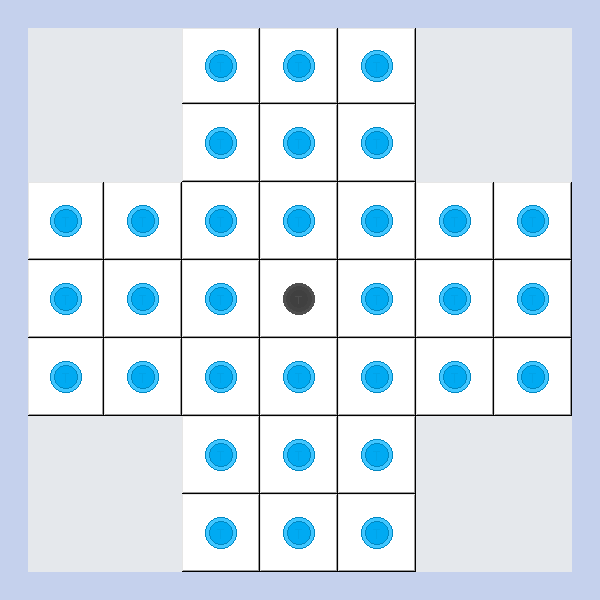
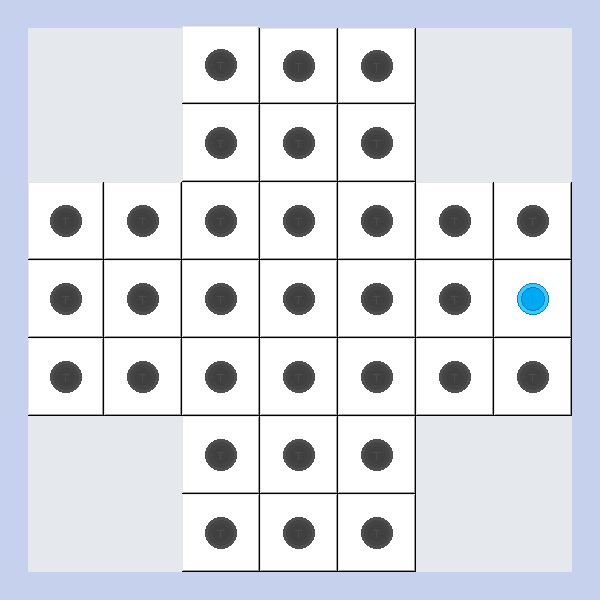
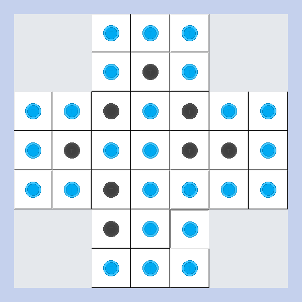
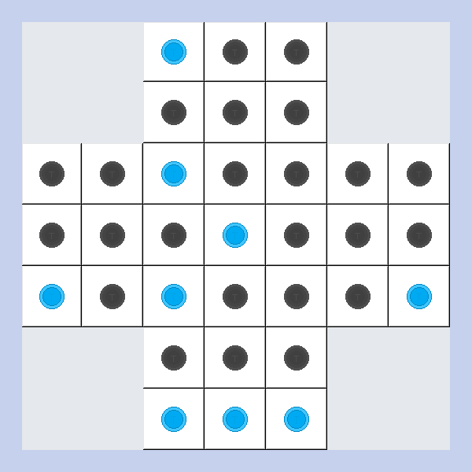

# Resta Um🏴

A "Resta Um" game built with Python using the Tkinter library. 

## Instructions🏴

To play the game, download the files or clone the repo and run the Resta_Um(Game).py file.
Rules:
1) The game starts with 32 pieces, leaving only the middle spot empty.
2) To move a piece, select it and "hop" it over any adjacent pieces right, left, above of below, landing it on the next square.
3) The piece that has been "hopped over" is removed from the board.
4) The game ends there are no more legal moves available.
5) The goal is to "hop over" all remaining pieces and leave a single piece on the board.
6) To restart the game, close the current window and rerun the game file.

## Preview🏴

The starting position with all 32 pieces alongside the won position.✔️

  
  

An example of a lost game where there are no more legal moves.❌

  
  

<!-- 
## Takeaway
-->
